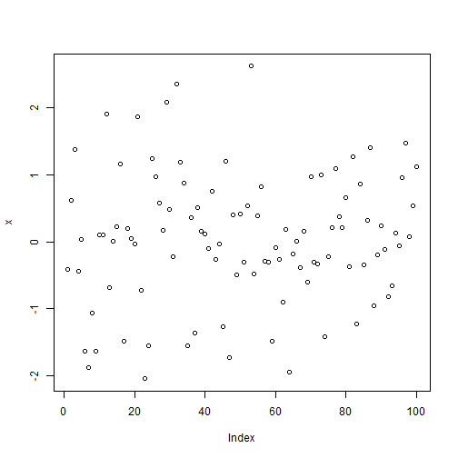
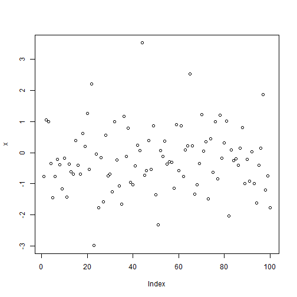
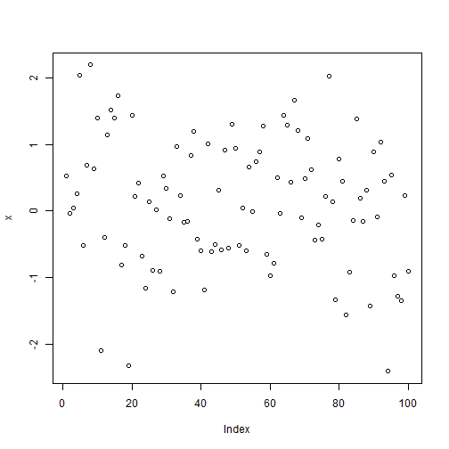
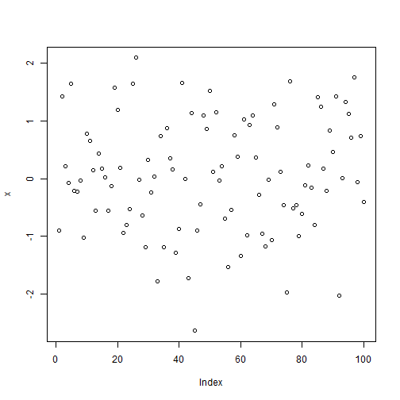
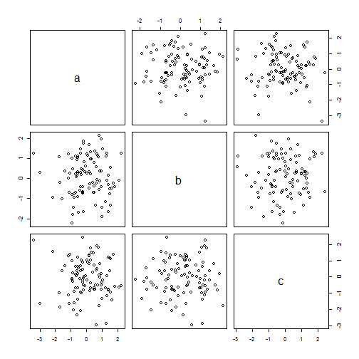
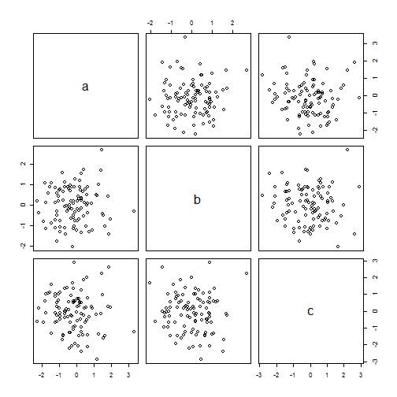
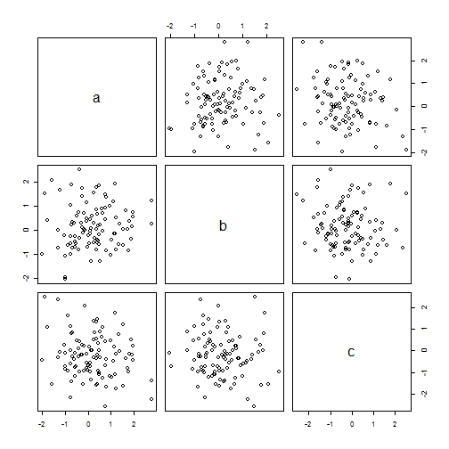
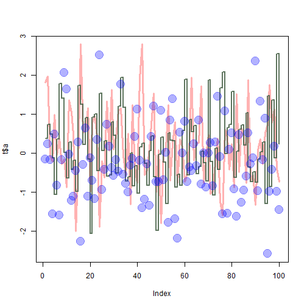
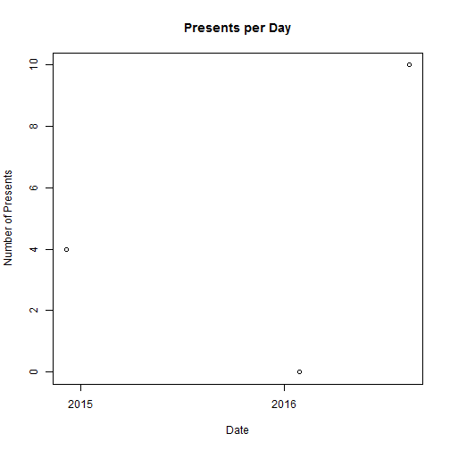

### github username: wovow
### document link:[link](https://cran.r-project.org/doc/contrib/Torfs+Brauer-Short-R-Intro.pdf) 
### This is a document that contains the code to demonstrate each Todo in the "A (very) short introduction to R" link posted above.

## ToDo 1

Compute the difference between 2014 and the
year you started at this university and divide
this by the difference between 2014 and the year
you were born. Multiply this with 100 to get
the percentage of your life you have spent at
this university. Use brackets if you need them.


```r
(2014-2014)/(2014-1993)*100
```

```
## [1] 0
```

## ToDo 2

Repeat the previous ToDo, but with several
steps in between. You can give the variables
any name you want, but the name has to start
with a letter.


```r
year.defualt <- 2014
school.started <- 2014
born <- 199

(year.defualt-school.started)/(year.defualt-born )*100
```

```
## [1] 0
```

## ToDo 3

Compute the sum of 4, 5, 8 and 11 by first combining
them into a vector and then using the
function sum.


```r
a = c(4,5,8,11) 

sum(a)
```

```
## [1] 28
```


## ToDo 4

Plot 100 normal random numbers.


```r
x = rnorm(100)
plot(x)
```




## ToDo 5

Find help for the sqrt function.


```r
help(sqrt)
```


MathFun {base}	R Documentation
Miscellaneous Mathematical Functions

Description

abs(x) computes the absolute value of x, sqrt(x) computes the (principal) square root of x, √{x}.

The naming follows the standard for computer languages such as C or Fortran.

Usage

abs(x)
sqrt(x)
Arguments

x	
a numeric or complex vector or array.

Details

These are internal generic primitive functions: methods can be defined for them individually or via the Math group generic. For complex arguments (and the default method), z, abs(z) == Mod(z) and sqrt(z) == z^0.5.

abs(x) returns an integer vector when x is integer or logical.

S4 methods

Both are S4 generic and members of the Math group generic.

References

Becker, R. A., Chambers, J. M. and Wilks, A. R. (1988) The New S Language. Wadsworth & Brooks/Cole.

See Also

Arithmetic for simple, log for logarithmic, sin for trigonometric, and Special for special mathematical functions.

‘plotmath’ for the use of sqrt in plot annotation.


## ToDo 6

Make a file called firstscript.R containing Rcode
that generates 100 random numbers and
plots them, and run this script several times.


```r
source("firstscript.R")
```




```r
source("firstscript.R")
```




```r
source("firstscript.R")
```



## ToDo 7

Put the numbers 31 to 60 in a vector named
P and in a matrix with 6 rows and 5 columns
named Q. Tip: use the function seq. Look at
the different ways scalars, vectors and matrices
are denoted in the workspace window.


```r
P =  seq(from=31, to=60, by=1)

Q = matrix(data=seq(from=31, to=60, by=1),ncol=5, nrow=6)

print(P)
```

```
##  [1] 31 32 33 34 35 36 37 38 39 40 41 42 43 44 45 46 47 48 49 50 51 52 53
## [24] 54 55 56 57 58 59 60
```

```r
print(Q)
```

```
##      [,1] [,2] [,3] [,4] [,5]
## [1,]   31   37   43   49   55
## [2,]   32   38   44   50   56
## [3,]   33   39   45   51   57
## [4,]   34   40   46   52   58
## [5,]   35   41   47   53   59
## [6,]   36   42   48   54   60
```


## ToDo 8

Make a script file which constructs three random
normal vectors of length 100. Call these
vectors x1, x2 and x3. Make a data frame called
t with three columns (called a, b and c) containing
respectively x1, x1+x2 and x1+x2+x3.
Call the following functions for this data frame:
plot(t) and sd(t). Can you understand the
results? Rerun this script a few times.


```r
source("todo_8.R")
```



```r
source("todo_8.R")
```




## ToDo 9

Add these lines to the script file of the previous
section. Try to find out, either by experimenting
or by using the help, what the meaning is of
rgb, the last argument of rgb, lwd, pch, cex.


```r
source("todo_9.R")
```



RGB is used to create colours corresponding to the intensities (of 0 and max) of the red, green and blue primaries. (rgb(red, green, blue, alpha, names = NULL, maxColorValue = 1))

lwd is the line width (must be apositive number, default is 1).

pch is the option to specify what symbols to use when plotting points, pch=20 will use grey filled circles to plot points

cex specifies the amount by which plotting text and symbols should be scaled relative to the default of 1. cex = 4 means text and symbols will be 400% larger.


## ToDo 10

Make a file called tst1.txt in Notepad from
the example in Figure 4 and store it in your
working directory. Write a script to read it, to
multiply the column called g by 5 and to store
it as tst2.txt.


```r
d2 = read.table(file="tst1.txt", header=TRUE)

d2$g = d2$g * 5

write.table(d2, file="tst2.txt")
```

## ToDo 11

Compute the mean of the square root of a vector
of 100 random numbers. What happens?


```r
mean(sqrt(rnorm(100)))
```

```
## Warning in sqrt(rnorm(100)): NaNs produced
```

```
## [1] NaN
```

This resulted in a not a number warning (NAN) since the random function produced a negative number and you cannot take the sqaure root of a negative number

## ToDo 12

Make a graph with on the x-axis: today, Sinterklaas
2014 and your next birthday and on
the y-axis the number of presents you expect on
each of these days. Tip: make two vectors first.


```r
date1 = as.Date(c("27/01/2016",
"06/12/2014", "11/08/2016"), format = "%d/%m/%Y")

presents = c(0, 4, 10)
plot (date1, presents, main="Presents per Day", xlab="Date", ylab="Number of Presents")
```



## ToDo 13

Make a vector from 1 to 100. Make a for-loop
which runs through the whole vector. Multiply
the elements which are smaller than 5 and larger
than 90 with 10 and the other elements with 0.1.


```r
a = seq(from=1, to=100, by=1)

for (i in a)
  {
  if (i < 5 | i > 90)
    {
    a[i] = a[i] * 10
    }else{
    a[i] = a[i] * 0.1 
    }
  }

print(a)
```

```
##   [1]   10.0   20.0   30.0   40.0    0.5    0.6    0.7    0.8    0.9    1.0
##  [11]    1.1    1.2    1.3    1.4    1.5    1.6    1.7    1.8    1.9    2.0
##  [21]    2.1    2.2    2.3    2.4    2.5    2.6    2.7    2.8    2.9    3.0
##  [31]    3.1    3.2    3.3    3.4    3.5    3.6    3.7    3.8    3.9    4.0
##  [41]    4.1    4.2    4.3    4.4    4.5    4.6    4.7    4.8    4.9    5.0
##  [51]    5.1    5.2    5.3    5.4    5.5    5.6    5.7    5.8    5.9    6.0
##  [61]    6.1    6.2    6.3    6.4    6.5    6.6    6.7    6.8    6.9    7.0
##  [71]    7.1    7.2    7.3    7.4    7.5    7.6    7.7    7.8    7.9    8.0
##  [81]    8.1    8.2    8.3    8.4    8.5    8.6    8.7    8.8    8.9    9.0
##  [91]  910.0  920.0  930.0  940.0  950.0  960.0  970.0  980.0  990.0 1000.0
```

## ToDo 14

Write a function for the previous ToDo, so
that you can feed it any vector you like
(as argument). Use a for-loop in the function
to do the computation with each element.
Use the standard R function length
in the specification of the counter.


```r
funt1 = function(vect)
  {
  for (i in 1:length(vect))
    {
    if (i < 5 | i > 90)
      {
      vect[i] = vect[i] * 10
      }else{
      vect[i] = vect[i] * 0.1 
      }
    }
  return (vect) 
  }

a = seq(from=1, to=100, by=1)
funt1(vect = a)
```

```
##   [1]   10.0   20.0   30.0   40.0    0.5    0.6    0.7    0.8    0.9    1.0
##  [11]    1.1    1.2    1.3    1.4    1.5    1.6    1.7    1.8    1.9    2.0
##  [21]    2.1    2.2    2.3    2.4    2.5    2.6    2.7    2.8    2.9    3.0
##  [31]    3.1    3.2    3.3    3.4    3.5    3.6    3.7    3.8    3.9    4.0
##  [41]    4.1    4.2    4.3    4.4    4.5    4.6    4.7    4.8    4.9    5.0
##  [51]    5.1    5.2    5.3    5.4    5.5    5.6    5.7    5.8    5.9    6.0
##  [61]    6.1    6.2    6.3    6.4    6.5    6.6    6.7    6.8    6.9    7.0
##  [71]    7.1    7.2    7.3    7.4    7.5    7.6    7.7    7.8    7.9    8.0
##  [81]    8.1    8.2    8.3    8.4    8.5    8.6    8.7    8.8    8.9    9.0
##  [91]  910.0  920.0  930.0  940.0  950.0  960.0  970.0  980.0  990.0 1000.0
```


## ToDo 15


```r
funt1 = function(vect)
  {
  return (ifelse(vect < 5 | vect > 90, vect * 10, vect * 0.1)) 
  }

a = seq(from=1, to=100, by=1)
funt1(vect = a)
```

```
##   [1]   10.0   20.0   30.0   40.0    0.5    0.6    0.7    0.8    0.9    1.0
##  [11]    1.1    1.2    1.3    1.4    1.5    1.6    1.7    1.8    1.9    2.0
##  [21]    2.1    2.2    2.3    2.4    2.5    2.6    2.7    2.8    2.9    3.0
##  [31]    3.1    3.2    3.3    3.4    3.5    3.6    3.7    3.8    3.9    4.0
##  [41]    4.1    4.2    4.3    4.4    4.5    4.6    4.7    4.8    4.9    5.0
##  [51]    5.1    5.2    5.3    5.4    5.5    5.6    5.7    5.8    5.9    6.0
##  [61]    6.1    6.2    6.3    6.4    6.5    6.6    6.7    6.8    6.9    7.0
##  [71]    7.1    7.2    7.3    7.4    7.5    7.6    7.7    7.8    7.9    8.0
##  [81]    8.1    8.2    8.3    8.4    8.5    8.6    8.7    8.8    8.9    9.0
##  [91]  910.0  920.0  930.0  940.0  950.0  960.0  970.0  980.0  990.0 1000.0
```


